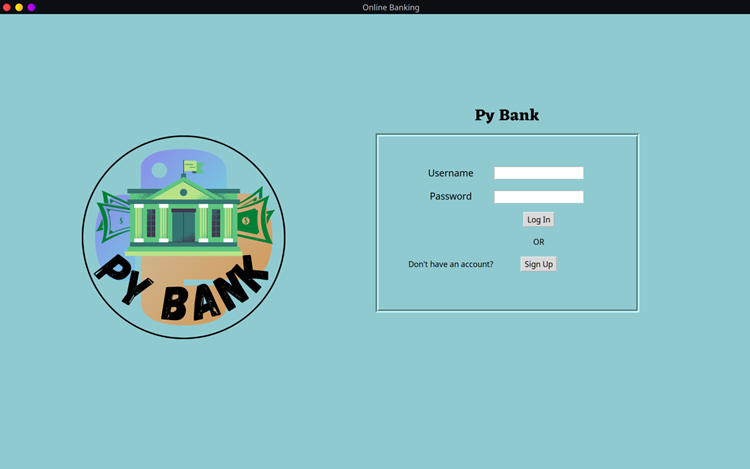
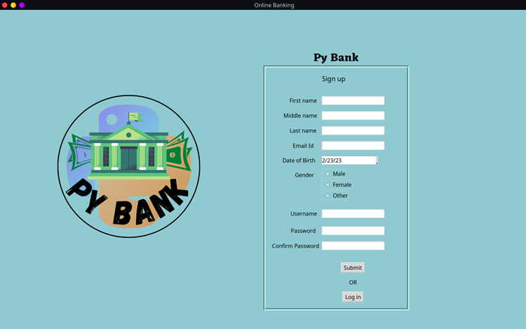
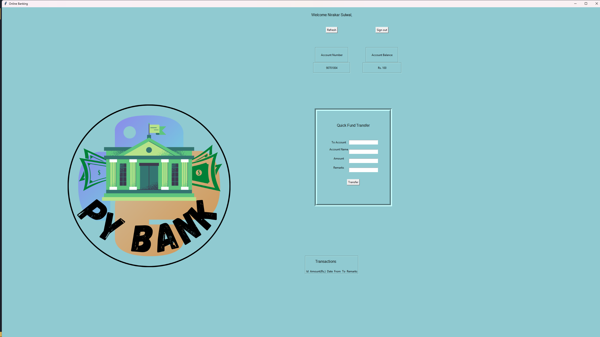

# PyBank - Python Banking System

A comprehensive desktop banking application built with Python and Tkinter, featuring a modern GUI for managing bank accounts, transactions, and user authentication.

## 🌟 Features

### User Management

- **Secure User Registration**: Create new bank accounts with comprehensive validation
- **User Authentication**: Secure login system with username and password verification
- **Profile Management**: Edit and update user information
- **Account Number Generation**: Automatic assignment of unique account numbers

### Banking Operations

- **Account Balance Management**: View current account balance
- **Fund Transfer**: Transfer money between accounts with transaction tracking
- **Transaction History**: Complete record of all transactions with timestamps
- **Quick Transfer**: Streamlined interface for frequent transfers

### Admin Features

- **Admin Panel**: Administrative interface for account management
- **CRUD Operations**: Create, Read, Update, and Delete user accounts
- **Account Overview**: View all registered accounts and their details

### Security & Validation

- **Email Validation**: Ensures valid email addresses during registration
- **Password Security**: Secure password handling and validation
- **Date Validation**: Comprehensive date of birth validation
- **Username Verification**: Prevents duplicate usernames

## � Screenshots

### Login Page


_Secure login interface with username and password authentication_

### Sign Up Page


_User registration form with comprehensive validation_

### Dashboard


_Main user dashboard with account information and quick transfer options_

## �🛠️ Technology Stack

- **Frontend**: Tkinter (Python GUI framework)
- **Database**: SQLite3 for data persistence
- **Image Processing**: PIL (Python Imaging Library)
- **Date Picker**: tkcalendar for date selection
- **Validation**: Custom validation modules and validate_email library
- **Data Generation**: Faker library for testing data

## 📁 Project Structure

```
py_bank/
├── main.py              # Main application entry point and GUI
├── DataActions.py       # Database operations and data management
├── check_cred.py        # User credential validation
├── transfer.py          # Money transfer and transaction handling
├── admin_crude.py       # Admin panel and CRUD operations
├── bank_data.db         # SQLite database file
├── readme.md           # This file
└── images/             # Application logos and UI images
    ├── logo*           # Various logo files
    ├── title.png       # Application title image
    └── ...
```

## 🚀 Installation & Setup

### Prerequisites

- Python 3.6 or higher
- pip (Python package installer)

### Required Dependencies

Install the required packages using pip:

```bash
pip install -r requirements.txt
```

### Running the Application

1. Clone or download the project to your local machine
2. Navigate to the project directory
3. Run the main application:

```bash
python main.py
```

For admin panel access:

```bash
python admin_crude.py
```

## 💾 Database Schema

### Account Table

- `first_name` (TEXT): User's first name
- `middle_name` (TEXT): User's middle name
- `last_name` (TEXT): User's last name
- `email` (TEXT): User's email address
- `dob` (TEXT): Date of birth
- `gender` (TEXT): User's gender
- `username` (TEXT): Unique username for login
- `password` (TEXT): User's password
- `balance` (INTEGER): Account balance
- `accnumber` (INTEGER): Unique account number

### Transaction History Table

- `id` (TEXT): Transaction ID
- `amount` (INTEGER): Transaction amount
- `date` (TEXT): Transaction date and time
- `from_acc` (TEXT): Sender's account
- `to_acc` (TEXT): Recipient's account
- `remarks` (TEXT): Transaction remarks
- `status` (TEXT): Transaction status

## 🎯 How to Use

### For Regular Users

1. **First Time Users**:

   - Click "Sign Up" on the login screen
   - Fill in all required information
   - Create a unique username and secure password
   - Submit to create your account

2. **Existing Users**:

   - Enter your username and password
   - Click "Log In" to access your account

3. **Making Transfers**:
   - Use the Quick Fund Transfer section
   - Enter recipient's account number
   - Specify amount and add remarks
   - Confirm the transfer

### For Administrators

1. Run `admin_crude.py` to access the admin panel
2. View all registered accounts
3. Add, edit, or delete user accounts as needed
4. Monitor system usage and account status

## 🔧 Key Modules

- **`main.py`**: Core application with GUI components and user interaction handling
- **`DataActions.py`**: Database connection and SQL operations
- **`check_cred.py`**: Input validation and credential verification
- **`transfer.py`**: Transaction processing and money transfer logic
- **`admin_crude.py`**: Administrative functions and account management

## 🔐 Security Features

- Password masking during input
- Username uniqueness validation
- Email format verification
- Secure database operations
- Transaction status tracking

## 🎨 User Interface

The application features a modern, user-friendly interface with:

- Custom color scheme and branding
- Logo and title graphics
- Intuitive form layouts
- Error message displays
- Responsive button interactions

## 📝 Notes

- The application automatically creates the database and tables on first run
- Default account balance for new users is 100 units
- All transactions are logged with timestamps
- The system supports comprehensive error handling and user feedback
